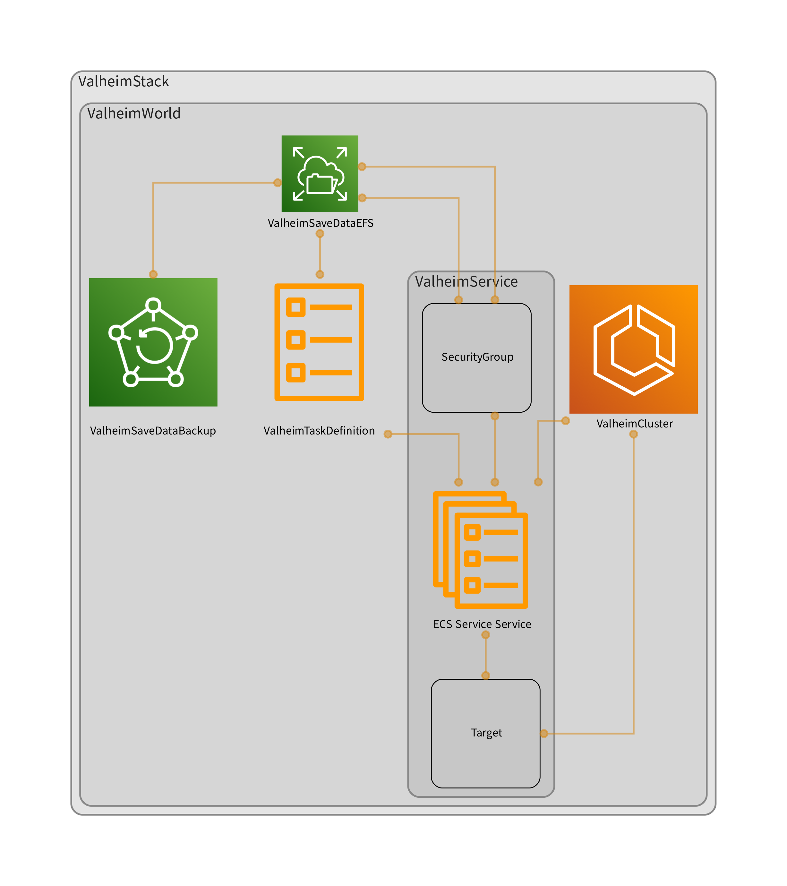

 [](https://github.com/gotodeploy/cdk-valheim/blob/main/LICENSE)  
# cdk-valheim

A high level CDK construct of [Valheim](https://www.valheimgame.com/) dedicated server.



## Features

- Fargate cluster to run a Valheim server, with EFS for persistence (schedulable)
- Hourly AWS Backup with 3 days retention (customizable)
- [lloesche/valheim-server](https://github.com/lloesche/valheim-server-docker) as the default container image (replaceable)

See [integration test](src/integ.valheim.ts) for an example.

## API Doc

See [API.md](API.md)

## References

- [On-demand, serverless Valheim server setup with AWS CDK, Discord Interactions and GitLab CI](https://briancaffey.github.io/2021/03/18/on-demand-dedicated-serverless-valheim-server-with-cdk-discrod-interactions/)
- [Grantapher/discord-cdk-valheim](https://github.com/Grantapher/discord-cdk-valheim)

## Examples

The construct is published to both npm and PyPI.

### TypeScript

```ts
new ValheimWorld(stack, 'ValheimWorld', {
  cpu: 2048,
  memoryLimitMiB: 4096,
  schedules: [{
    start: { hour: '12', weekDay: '1-5' },
    stop: { hour: '1', weekDay: '1-5' },
  }],
  environment: {
    SERVER_NAME: 'CDK Valheim',
    WORLD_NAME: 'Amazon',
    SERVER_PASS: 'fargate',
    BACKUPS: 'false',
  },
});
```

### Python

```python
ValheimWorld(
    self, 
    'ValheimWorld',   
    cpu=2048,
    memory_limit_mib=4096,
    schedules=[ValheimWorldScalingSchedule(
        start=CronOptions(hour='12', week_day='1-5'),
        stop=CronOptions(hour='1', week_day='1-5'),
    )],
    environment={
        'SERVER_NAME': 'CDK Valheim',
        'WORLD_NAME': 'Amazon',
        'SERVER_PASS': 'fargate',
        'BACKUPS': 'false',
    })
```

## Testing

* Unit test and snapshot test

```sh
npx projen test
```

* Integration test

```sh
npx cdk -a "npx ts-node src/integ.valheim.ts" diff
npx cdk -a "npx ts-node src/integ.valheim.ts" deploy
```
